# Kita "Aura" Ikuyo: current abilities and effects

Subsequent visual update: Kita's black/blue skull appearances have been replaced
with ivory-and-gold feather bolts. The attack mechanics described below remain
unchanged. See [feather projectile proof](kita-feather-projectiles-20260908.md).
The skull screenshots in this report preserve the pre-change audit.

Audited against the current source on 2026-09-08, based on gameplay commit
8b1bf23. The audit adds only opt-in proof tooling and documentation.
KitaAngelBossEntity extends WitherEntity without overriding any gameplay.
She is an angel visually, but her attacks and most behavior are Java 1.20.1 Wither behavior.

## Evidence and limits

The screenshots are original 1280x720 client framebuffer captures from
`gradlew.bat --no-daemon runClient -PbossAbilityProof`.
The repository launcher hides the game window and mutes all sound categories.
The disposable arena uses Normal difficulty, mobGriefing=true, a creative
observer, and normal boss AI. Bosses are created by actually using her spawn
egg on a block through SpawnEggItem.useOnBlock.

Staging supplies targets and starting health; it does not implement attacks,
projectile collisions, regeneration, destruction, or rewards. The golem has
1000 health and disabled movement to survive observation. The final victim
starts with extra health, receives a natural skull hit, then is reduced to 1 HP
so the already-applied Wither effect finishes it. Further boss attacks are
disabled in that isolated rose scene to keep later blasts from destroying drops.
The charge demonstration explicitly invokes inherited onSummoned(); this is
NOT called by the normal Kita spawn egg. Fire is explicitly applied to test
the current immunity configuration.

A still image proves appearance at that instant, not targeting rules, damage
numbers, timing, resistance, or sound. Those details below are source-verified;
runtime state lines supplement the captures in `kita-abilities-observations.txt`.
The half-health screenshot is not an arrow-blocking test.

## 1. Spawn, stats, appearance, boss bar

- Her dedicated egg is in the Creative Spawn Eggs tab. Commands can also summon
  `ryo-blocks:kita_angel_boss`. No natural spawn rules or custom ritual exist.
- The standard soul-sand/skull ritual still makes a vanilla Wither.
- Egg spawn starts at 300 HP (150 hearts), 4 armor points, and Invul=0.
- Follow-range attribute: 40 blocks. Movement and flying speed attributes: 0.6.
- Purple health bar, normally white name, and boss sky darkening.
- Original slim player skin at 1.85 render scale, slowly turning gold emissive
  halo, gently moving solid feather wings, hovering bob and leg sway.
- The halo is cosmetic: no healing buff, damage aura, or actual block lighting.
- Physical dimensions are 0.9 wide x 3.5 high. The wings are not separate hitboxes.
- The renderer suppresses Wither body smoke/effect particles and does not draw
  the Wither shield overlay. Projectile smoke and explosions still appear.

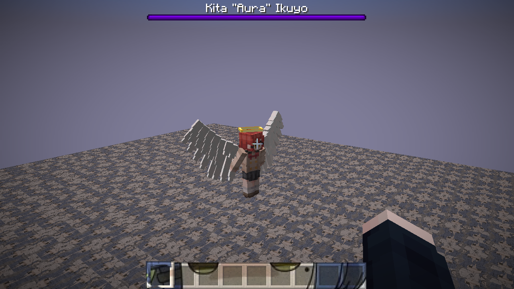

For a front view of the unchanged skin, halo and wings:

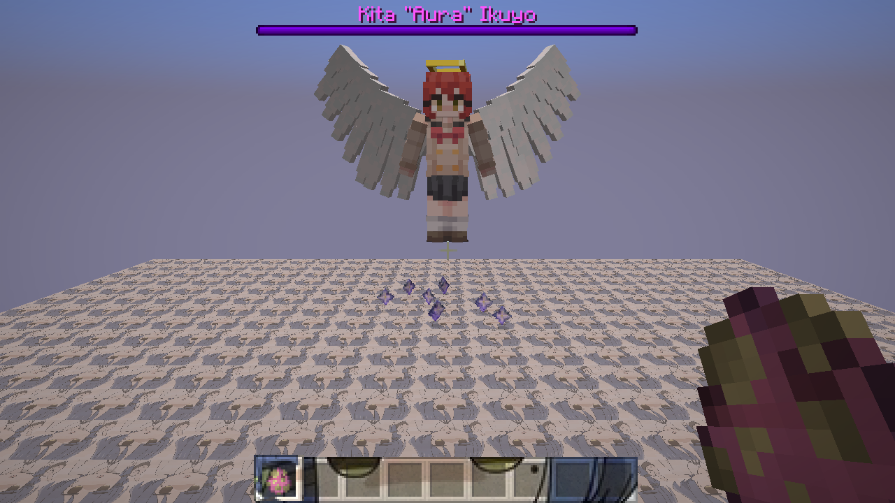

## 2. Flight, pursuit, targeting and ranged attacks

- Flies after targets; above half health she tries to stay above them, including
  the inherited approximately five-block altitude preference.
- Targets non-undead mobs and attackable players, and retaliates when attacked.
  Creative/spectator players are not normal targets.
- Can fight several targets using three inherited firing channels, although
  her model has only one visible head.
- Center attack goal uses a 40-tick interval (2 seconds at normal tick rate);
  successful side shots reset their timers to 40-59 ticks.
- Side targets are selected within 20 blocks and can be retained up to 30 blocks
  with line of sight. Center projectile goal range is 20 blocks.
- Skull origins remain vanilla center/side-head coordinates; they are not
  attached to her hands or animated as a spell cast.
- There is no custom melee combo, wing strike, dash, beam, or minion summon.

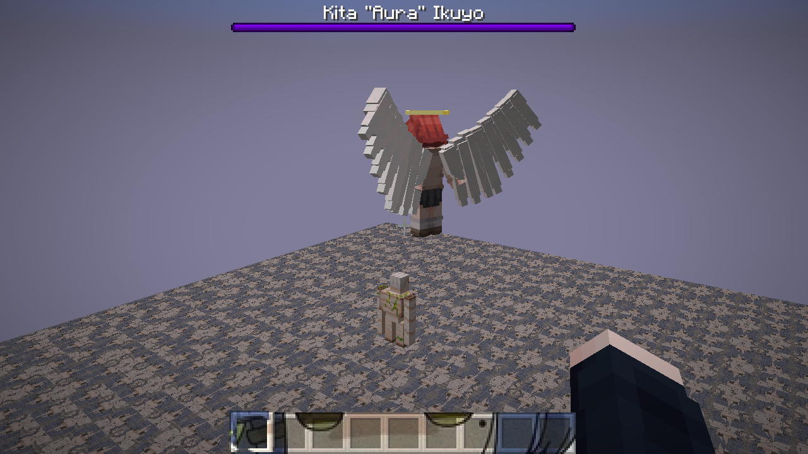

## 3. Normal skull impact and Wither damage

- Fires vanilla black Wither skulls.
- An owned skull's direct hit attempts 8 HP damage before mitigation.
  Its collision also creates a strength-1, non-incendiary explosion.
- Successful hits apply Wither II for 10 seconds on Normal and 40 seconds on
  Hard; Easy applies no Wither status. Damage-over-time is additional.
- Explosions can hurt entities and damage blocks; mobGriefing controls terrain
  damage, not whether the projectile can hurt a target.
- Skulls cannot be punched back like ghast fireballs.

The shot below shows a struck target and the projectile trail. The server confirmed
the target had Wither; the exact duration is established by code.

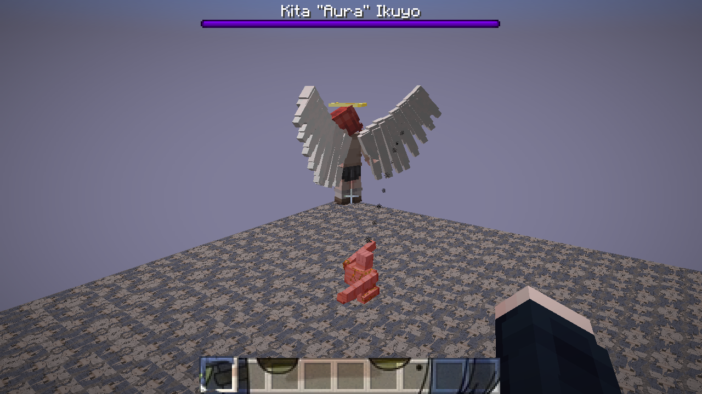

## 4. Blue charged skulls

- Idle side channels periodically fire blue charged skulls on Normal/Hard.
  Taking damage advances their charged-shot counters.
- Center shots have a 0.1 percent charged-shot chance.
- Blue skulls move more slowly and reduce eligible blocks' effective blast
  resistance to at most 0.8, making them much more destructive to tough blocks.
- Blocks tagged wither_immune remain protected from this resistance reduction.

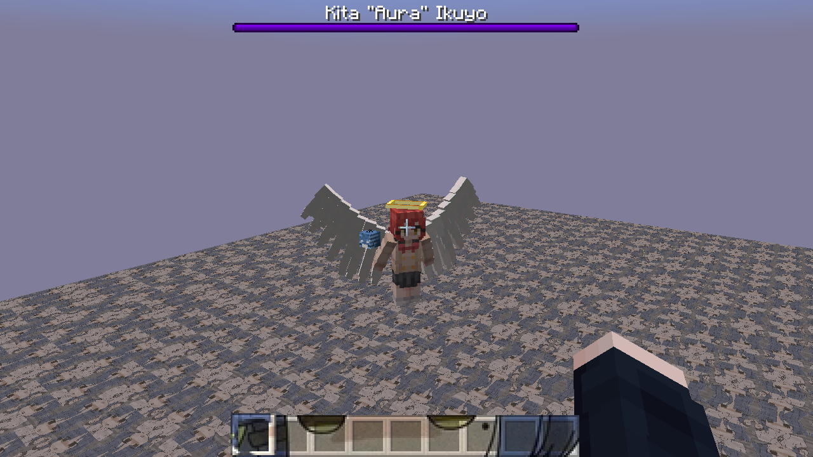

## 5. Half-health state

- At 150 HP or below, persistent projectiles such as arrows and tridents are
  rejected by the damage handler.
- She loses the above-target five-block preference and can fight lower down.
- Skull attacks continue; this does not add a new custom melee attack.
- There is currently no visible energy shield or separate phase costume.

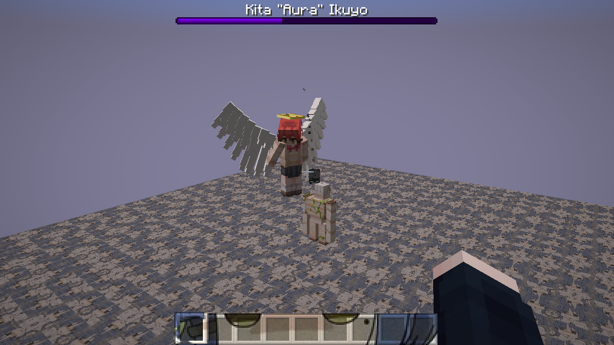

## 6. Regeneration and kill healing

- Passively heals 1 HP each second while AI ticks normally.
- A skull direct-hit kill heals its owner by 5 HP. This is not a general
  heal-on-every-explosion-kill rule.
- The observed regeneration sequence went from 210 HP to 215 HP in five seconds.
  The pictures show the bar; server observations establish the exact values.

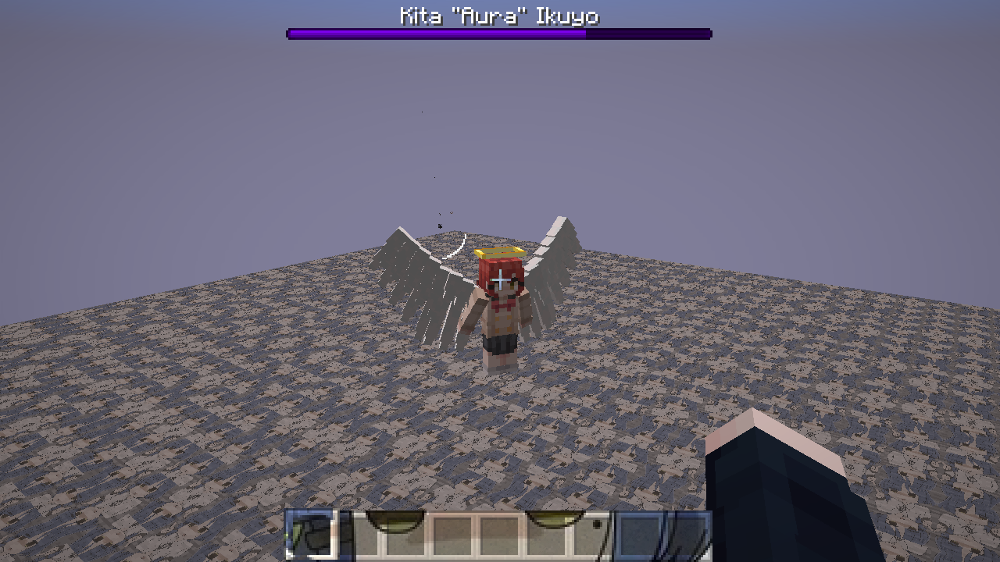

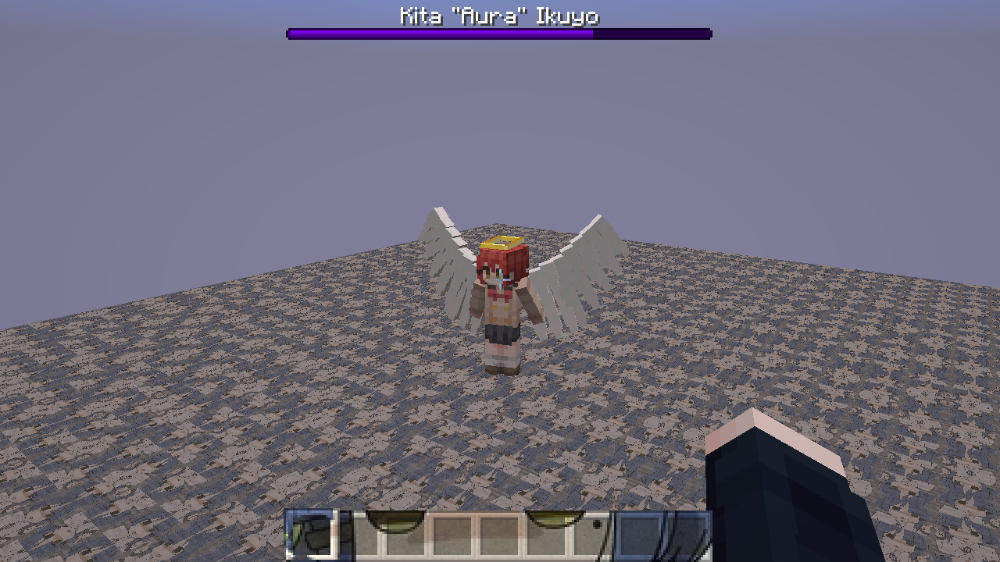

## 7. Breaking surrounding blocks

- Damage schedules a nearby block-breaking check after 20 ticks.
- With mobGriefing enabled, it breaks eligible blocks in a 3 x 4 x 3 region
  around her feet/body and creates block debris and drops.
- This is separate from projectile explosions. Protected wither_immune blocks
  are excluded.

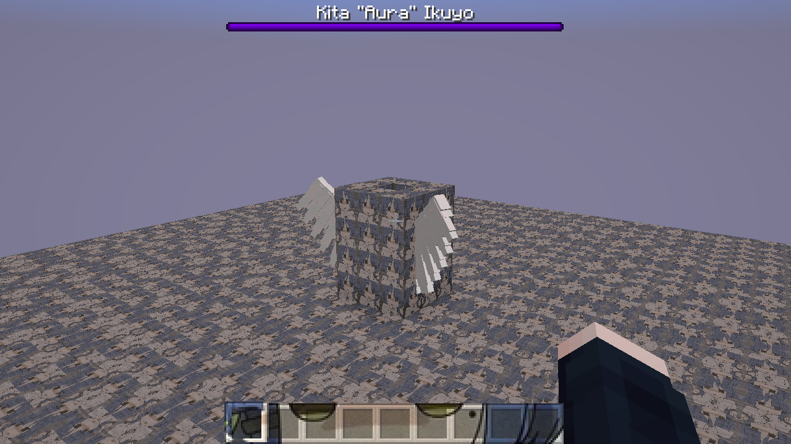

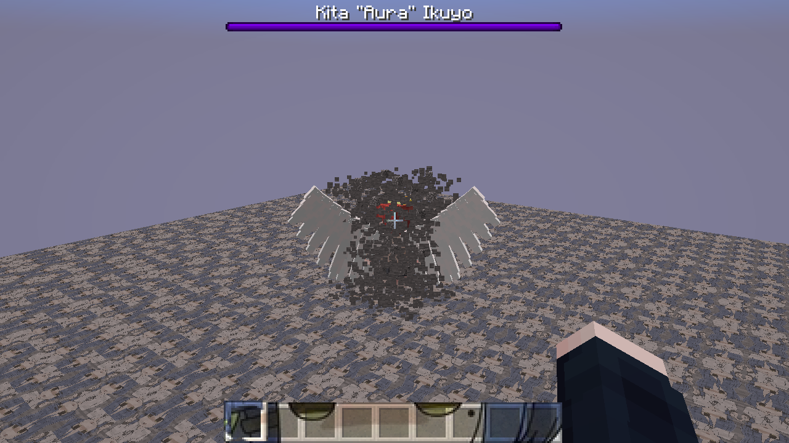

## 8. Death and rewards

- Drops one Nether Star through inherited equipment-drop code.
- Awards 50 XP when the normal player-kill attribution rules are satisfied.
- Uses the normal death animation, particles, and Wither death sound.
- No custom boss weapon, armor, wings item, loot table, or victory sequence.

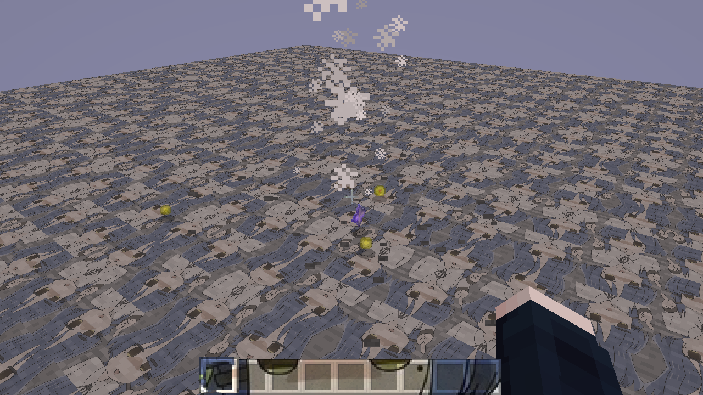

The purple star-like items in some earlier visual proofs were leftover
Nether Stars from test kills, not an implemented boss aura.

## 9. Wither roses from victims

- A living victim killed by her can leave a Wither rose.
- The inherited victim-death handler plants it when placement is valid and
  mobGriefing allows it; otherwise it drops a Wither rose item.

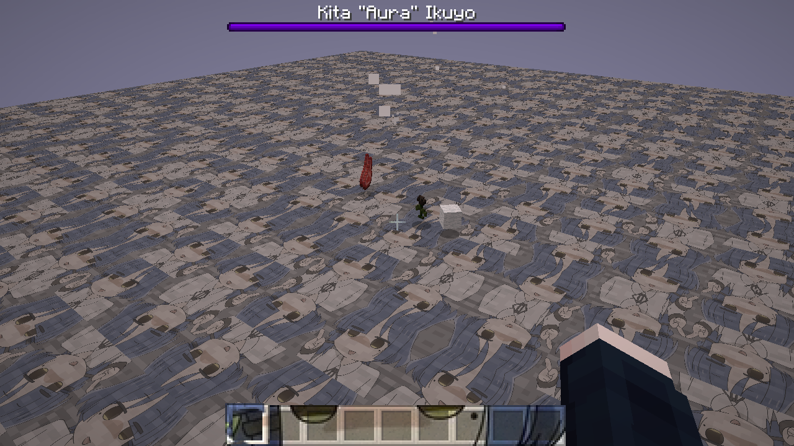

## 10. Resistances and vulnerabilities

- Mechanically undead: Smite is relevant despite the angel appearance.
- Rejects applied status effects, including Wither and ordinary potion statuses.
- Immune to drowning damage and attacks owned by another Wither.
- Rejects damage attributed to non-player living attackers in the same undead group.
- Arrow/trident rejection only applies at half health or below.
- Unlike vanilla Wither registration, this custom type is NOT fire-immune and
  is absent from the vanilla fall_damage_immune entity tag.
- Fire vulnerability was reproduced: visible flames and 299 HP from a full
  300-HP start despite regeneration. Fall vulnerability is source-verified,
  not exercised in these captures.

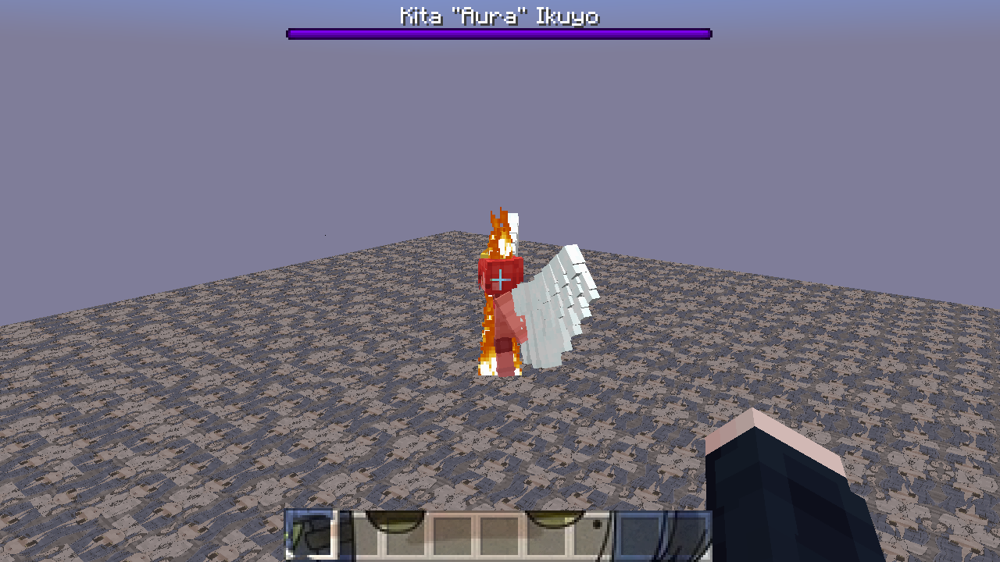

There is no meaningful still screenshot that independently proves all the
invisible resistance rules; the half-health and fire frames show their associated states.

## 11. Conditional charge and spawn explosion

This exists through inheritance but is NOT part of her normal spawn-egg route.
Calling onSummoned explicitly sets 220 invulnerable ticks (11 seconds), starts
at one-third health, fills the boss bar, heals 10 HP every 10 ticks, and finishes
with a strength-7 non-incendiary explosion and the Wither spawn sound.
The custom renderer does not show the vanilla charging skin/size transition.

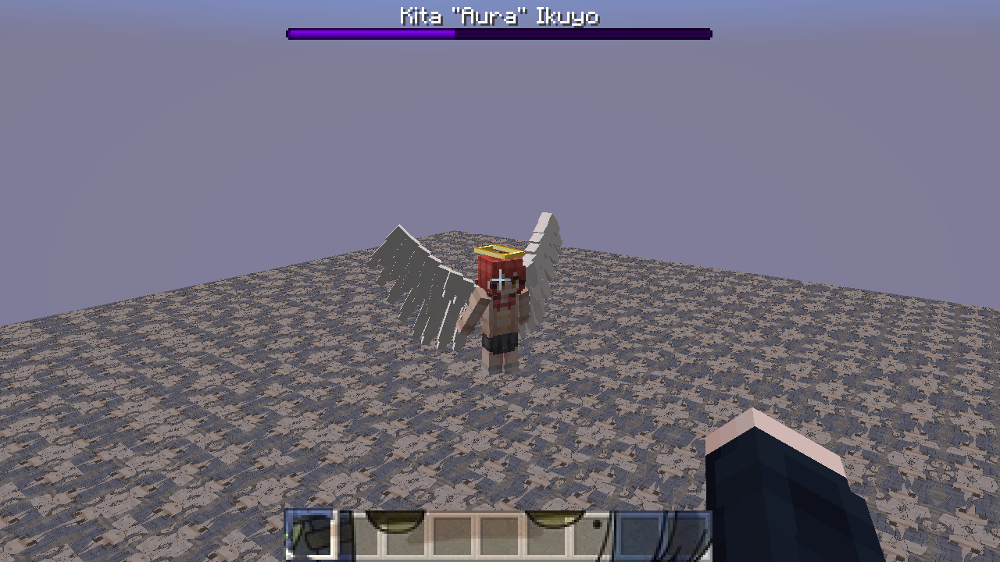

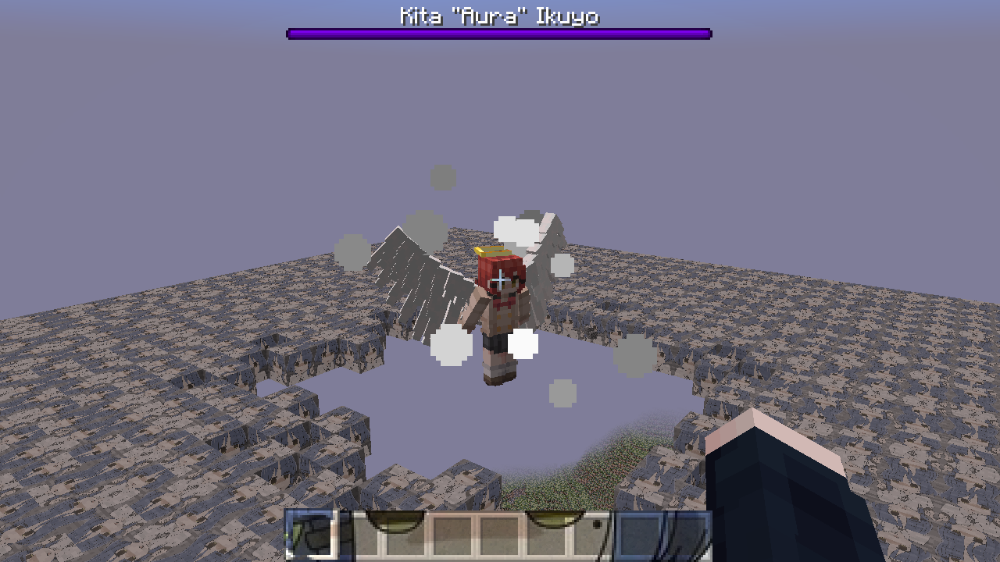

## 12. Other behavior and audio

- Does not despawn merely from distance; disappears in Peaceful.
- Cannot use portals or normally ride vehicles.
- Ignores the slowMovement callback used by slowing blocks.
- Uses vanilla Wither ambient, hurt, death, shot and conditional spawn sounds.
- No dedicated boss music or custom Kita voice/audio events are registered.
- No custom holy aura, player buff, resurrection, phase-specific dialogue,
  summoned helpers, arena controller, or post-fight scene exists.

Audio and persistence have no corresponding still visual effect. Audio was
kept speaker-muted; these sound assignments were checked in source.

## Source ownership

- `src/main/java/com/go4no/ryoblocks/entity/KitaAngelBossEntity.java`: empty Wither subclass.
- `src/main/java/com/go4no/ryoblocks/RyoBlocks.java`: entity registration, dimensions, egg and attributes.
- `src/client/java/com/go4no/ryoblocks/client/KitaAngelBossRenderer.java`: scale, hover, halo and wings.
- `src/client/java/com/go4no/ryoblocks/client/KitaAngelBossModel.java`: pose and overlay synchronization.
- `src/client/java/com/go4no/ryoblocks/mixin/client/WitherEntityMixin.java`: body-particle suppression.
- Locally cached Yarn 1.20.1+build.10 sources: WitherEntity, WitherSkullEntity,
  SpawnEggItem, WitherSkullBlock, LivingEntity, Entity.
- Locally cached vanilla data: damage_type/wither_immune_to and
  entity_types/fall_damage_immune tags.
