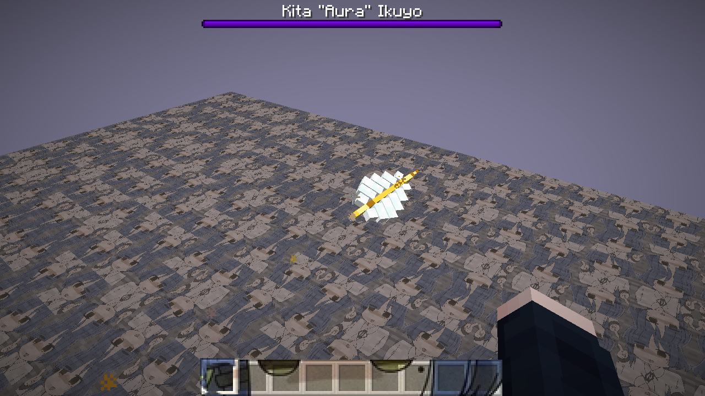
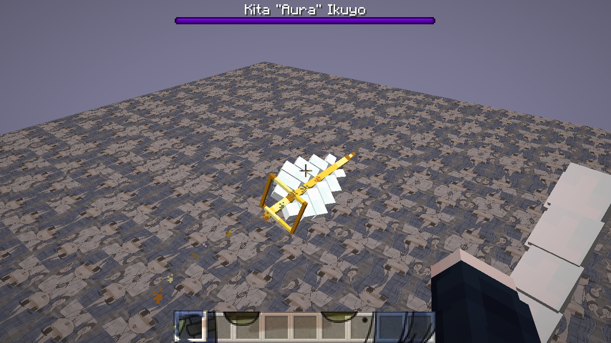
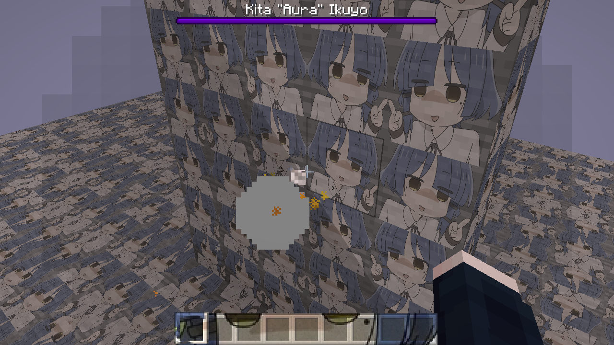
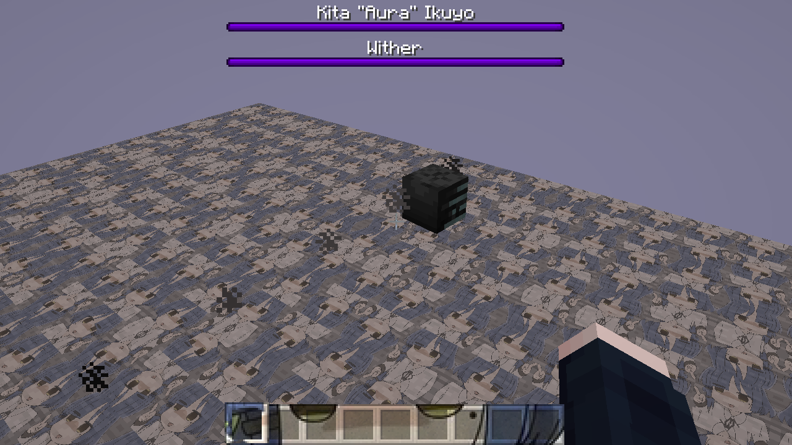
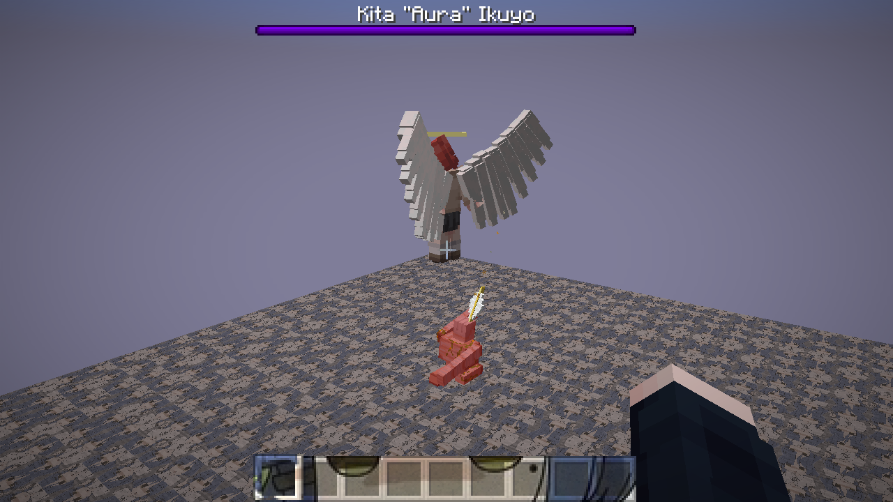
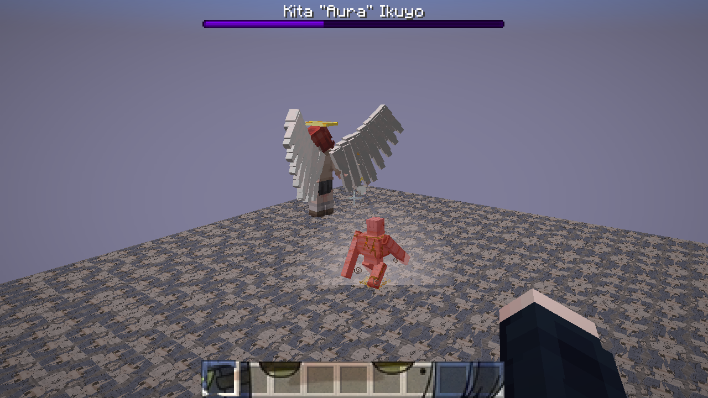

# Kita feather projectiles

Kita-owned skull projectiles now render as solid feather bolts: staggered,
swept-back ivory barbs, a gold shaft, and a stepped tip. The charged variant is
35 percent larger and carries a small rotating square halo around its quill.
Materials reuse Minecraft snow pixels and the existing gold halo texture.

The smoke trail becomes sparse gold/ivory pixel dust at shaft height.
Client-observed collisions add a short white flash, a square gold dust outline,
and feather-item fragments. The normal explosion burst, terrain debris, and
explosion sound remain alongside these accents. Water bubbles are preserved.
These local collision accents are cosmetic, not authoritative hit confirmation.

The original WitherSkullEntity is retained, including damage, speed, charged
blast resistance, Wither status, cooldowns, and firing origins. Ordinary Wither
owners still use the vanilla skull renderer and smoke. No hand-casting pose,
new damage status, or gameplay rebalance was introduced.

## Verification

- Hidden, all-sound-categories-muted normal AI combat:
  `gradlew.bat --no-daemon runClient -PbossAbilityProof`.
- Close-up normal/charged flight, impact and vanilla-owner comparison:
  `gradlew.bat --no-daemon runClient -PbossAbilityProof -PbossAbilityScene=14`.
- Close-ups launch normal WitherSkullEntity instances with actual owners and
  live projectile motion; the camera follows them. They are staged visual
  inspections, not claims about natural shot timing.
- The normal AI combat capture confirms the original boss firing route uses
  the feather renderer, and the struck golem still receives Wither.
- Build and packaged compatibility checks pass.

## Captures

The combat images document the initial visual pass; final close-ups include
the subsequent swept-barb, smaller-halo, and trail-height refinements.
